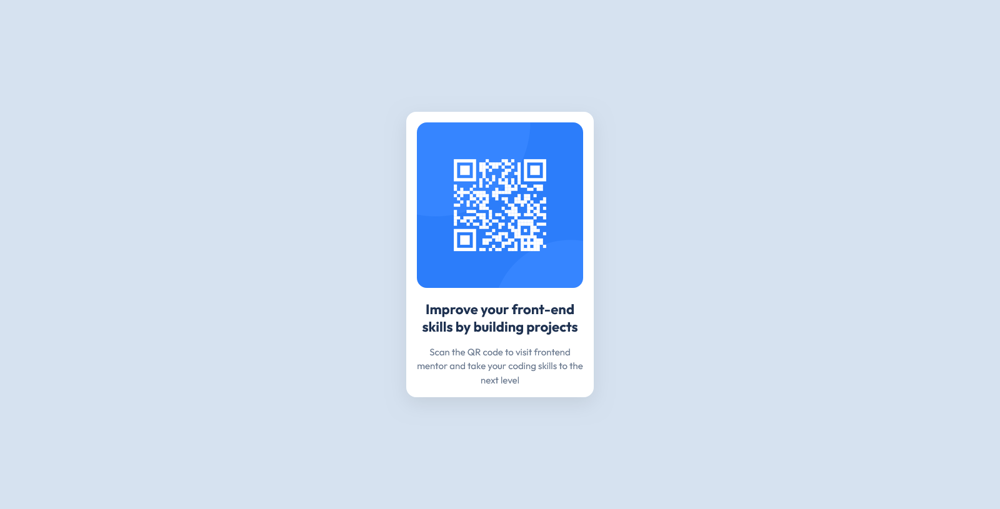

# Frontend Mentor - QR code component solution

This is my solution to the QR code component challenge on Frontend Mentor. This challenge helped me practice building a responsive card component using semantic HTML and CSS.

## Table of contents

- [Overview](#overview)
  - [Screenshot](#screenshot)
  - [Links](#links)
- [My process](#my-process)
  - [Built with](#built-with)
  - [What I learned](#what-i-learned)
  - [Continued development](#continued-development)
  - [Useful resources](#useful-resources)
  - [AI Collaboration](#ai-collaboration)
- [Author](#author)

## Overview

### Screenshot



### Links

- Solution URL: https://github.com/peace749/frontend-mentor-qr-code.git
- Live Site URL: https://peace749.github.io/frontend-mentor-qr-code/

## My process

### Built with

- Semantic HTML5 markup
- CSS custom properties
- Flexbox
- Mobile-first workflow
- Responsive design techniques

### What I learned

This project helped me improve my understanding of semantic HTML and responsive CSS. I learned how to structure content using meaningful HTML elements and how to center content on the page using grid.

One piece of code I was proud of was using semantic elements instead of relying only on `div` tags:

```html
<main>
  <article class="card">
    
    <h1>Improve your front-end skills by building projects</h1>
    <p>
      Scan the QR code to visit Frontend Mentor and take your coding
      skills to the next level
    </p>
  </article>
</main>
```

I also learned how to use CSS custom properties to keep my styles organized:

```css
:root {
  --white: hsl(0, 0%, 100%);
  --slate-300: hsl(212, 45%, 89%);
  --slate-500: hsl(216, 15%, 48%);
  --slate-900: hsl(218, 44%, 22%);
}
```

### Continued development

In future projects, I would like to continue improving:

- Responsive design skills
- CSS layout techniques
- Accessibility best practices
- Writing cleaner and more maintainable CSS

### Useful resources

- :contentReference[oaicite:0]{index=0} - Provided the challenge and design files.
- :contentReference[oaicite:1]{index=1} - Helped me understand HTML and CSS concepts.
- :contentReference[oaicite:2]{index=2} - Useful for quick references while learning.

### AI Collaboration

I used ChatGPT during this project to:

- Review my HTML and CSS

AI was helpful for learning and understanding concepts, but I wrote and tested the code myself.

## Author

- Frontend Mentor - [@peace749](https://www.frontendmentor.io/profile/peace749)
